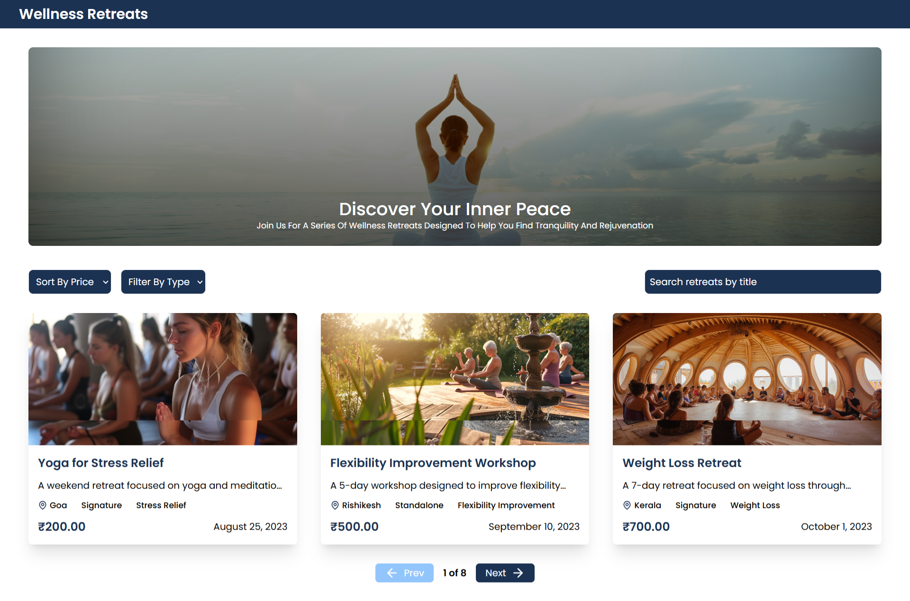

# Shoonya Wellness Retreats Assignment

### Deployed Link
**https://shoonya-wellness-retreats.vercel.app/**

## Getting Started

### Prerequisites

Make sure you have Node.js and npm installed on your system. You can download them from [nodejs.org](https://nodejs.org/).

### Installation

1. Clone the repository:

    ```bash
    git clone https://github.com/your-username/your-repo-name.git
    cd your-repo-name
    ```

2. Install the dependencies:

    ```bash
    npm install
    ```

## Running the Project

### Development

To start the server in development mode, run the following command:

```bash
npm run dev
```

### Production

To start the server in production mode, run the following command:

Run build command
```bash
npm run build
```
Start Production Server
```bash
npm run start
```

## Screeshots


